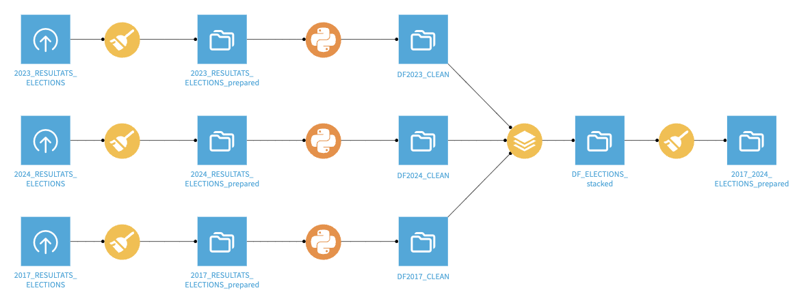
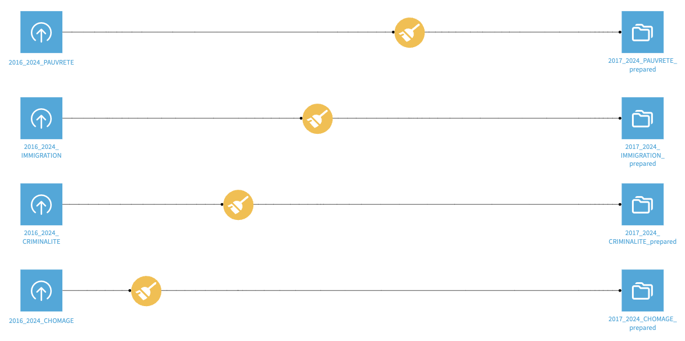

# 🗳️ Prédicteur de Résultats Électoraux

## ✨ Aperçu
Bienvenue dans notre projet de prédiction électorale ! Nous utilisons l'intelligence artificielle pour anticiper les résultats des élections en analysant les données historiques. Notre objectif ? Identifier des tendances et prédire avec précision les vainqueurs dans différentes circonscriptions.

## 🔍 Fonctionnalités
- 📊 Exploration interactive des données et visualisation des tendances électorales
- ⚙️ Ingénierie des caractéristiques à partir de données démographiques et historiques de vote
- 🤖 Modèles d'IA pour prédire les résultats électoraux
- 📈 Métriques d'évaluation de performance claires et précises

## 📂 Structure du Projet
- `data/` : Jeux de données électorales et socio-économiques
  - `2017_2024_CHOMAGE_prepared.csv` : Données sur le chômage (2017-2024)
  - `2017_2024_PAUVRETE_prepared.csv` : Données sur la pauvreté (2017-2024)
  - `2017_2024_ELECTIONS_prepared.csv` : Données électorales consolidées (2017-2024)
  - `2017_2024_CRIMINALITE_prepared.csv` : Données sur la criminalité (2017-2024)
  - `2017_2024_IMMIGRATION_prepared.csv` : Données sur l'immigration (2017-2024)
- `notebooks/` : Notebooks Jupyter pour l'exploration et le développement
  - `model_training.ipynb` : Développement et évaluation des modèles
- `models/` : Sauvegarde des modèles entraînés
- `src/` : Code source de l'application
- `venv/` : Environnement virtuel (non inclus dans git)

## ⚙️ Prétraitement des Données
Voici un aperçu de nos flux de prétraitement des données :

### Flux de données électorales


### Flux de données socio-économiques et autres


## 🧠 Modèles
Notre projet explore plusieurs algorithmes d'IA :
- 🌲 Random Forest Classifier (Forêts aléatoires)
- 🚀 Gradient Boosting Classifier (Boosting par gradient)
- 📊 Logistic Regression (Régression logistique)
- 🔄 Support Vector Machines (Machines à vecteurs de support)
- 👥 K-Nearest Neighbors (K plus proches voisins)
- 🌿 Decision Trees (Arbres de décision)

## 📊 Données
Notre jeu de données comprend :
- Données électorales historiques (résultats, participation, inscrits par département)
- Indicateurs socio-économiques (chômage, pauvreté)
- Données démographiques et sociales (criminalité, immigration)
- Code et nom du département
- Répartition des votes par parti politique
- Historique des vainqueurs potentiels (basé sur les résultats)

## 🚀 Installation

### Prérequis
- Python 3.13+
- pip

### C'est parti !
1. Clonez ce dépôt :
   ```bash
   git clone [repository-url]
   ```

2. Accédez au projet :
   ```bash
   cd election-result-predictor
   ```

3. Créez votre environnement :
   ```bash
   python -m venv venv
   source venv/bin/activate  # Sous Windows : venv\Scripts\activate
   ```

4. Installez tout ce qu'il faut :
   ```bash
   pip install -r requirements.txt
   ```

## 🎮 Utilisation
1. Vérifiez que votre environnement est bien configuré
2. Lancez Jupyter Notebook :
   ```bash
   jupyter notebook
   ```
3. Explorez les notebooks dans le dossier `notebooks` et commencez votre analyse !

## 📄 Licence
Ce projet est sous licence selon les termes du fichier LICENSE.

## 👥 L'équipe
- [@hicham](https://github.com/spideystreet)
- [@amine](https://github.com/testt753)
- [@wassim](https://github.com/Wassim38)

## 💬 Feedback
Vous avez des suggestions ou des questions ? N'hésitez pas à ouvrir une issue ou à nous contacter directement !
